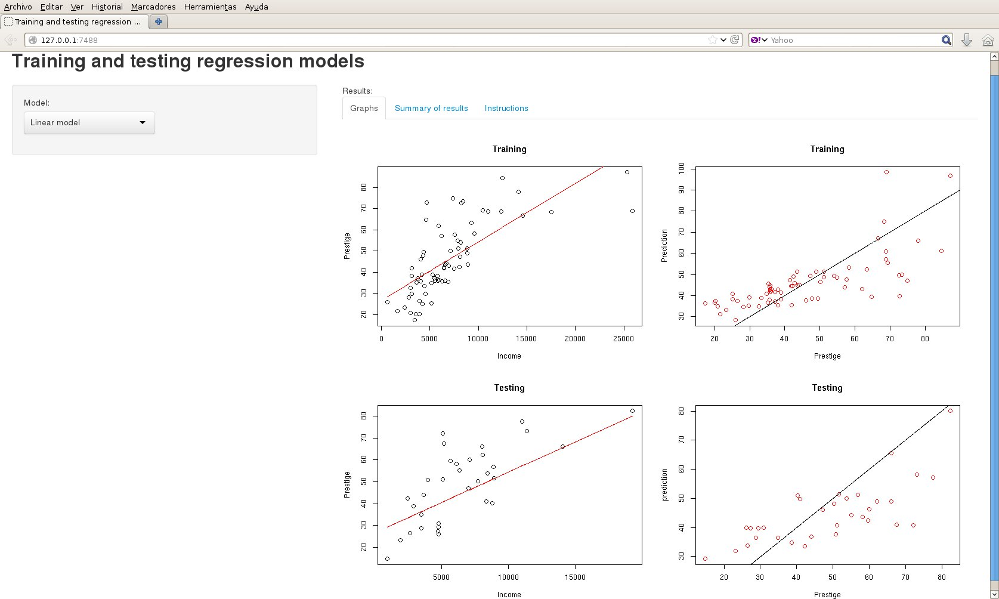

---
title       : An app to analyze regression models.
subtitle    : 
author      : Paco Alonso
job         : Coursera student
framework   : io2012        # {io2012, html5slides, shower, dzslides, ...}
highlighter : highlight.js  # {highlight.js, prettify, highlight}
hitheme     : tomorrow      # 
widgets     : [bootstrap, quiz, shiny,mathjax,  interactive]     # {mathjax, quiz, bootstrap}
mode        : selfcontained # {standalone, draft}
knit        : slidify::knit2slides

--- .class #id

## Purpose

### This app allows the user to check several different regression models using the Prestige data on the cars library.

1. Linear model
2. Polynomial
3. Generalized Linear Model
4. Generalized Additive Model
5. MultiAdaptative Regression Splines
6. Regression Random Forest
7. K-Nearest Neighbors
8. Support Vector Machines

### Selecting some of the models, a new widget will be open to choose the value of a parameter of the model.

--- .class #id

## A snapshot 



--- .class #id

## Some details

Selecting some of the models, a new widget will be open to choose the value of a parameter of the model.

It has 3 output tabs:

1. Graphics (graphical results)
2. Summary of results (numerical)
3. Insructions (how to use the app)

## Not included; however, ...

The app does not allow to do learning curves (may be in the next version :-). However they can be computed using the outpus of the app.

For instance, using the polynomial model, we can take the RMSE in training and testing for several different degrees and plot the corresponding training and testing error (next slide)

--- .class #id


```{r fig.height=6, fig.width=7}
training=c(10.48,10.46,10.37,10.38,10.24,10.1,10.03,10.03,10.02)
testing=c(11.88,11.95,12.25,12.24,12.28,12.61,12.08,12.08,14.73)
plot(deg,training,type="l",ylim=c(min(c(training,testing)),max(c(training,testing))),
xlab="Degree of the polynomial",ylab="RMSE")
lines(2:10,testing,col="red")
legend(2,14.5,legend=c("Training RMSE","Testing RMSE"),fill=c("black","red"))
```


